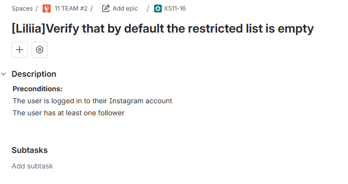
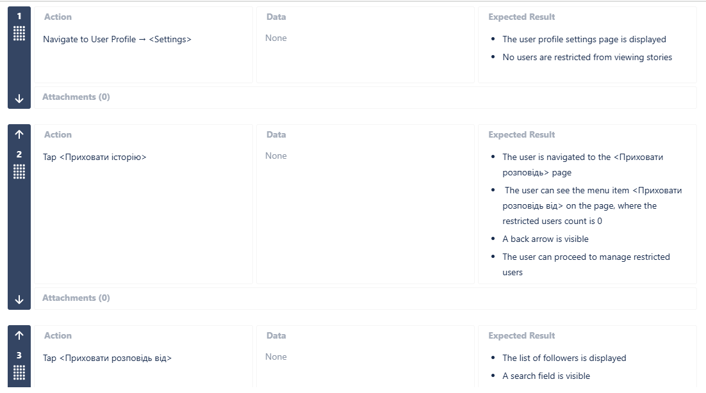
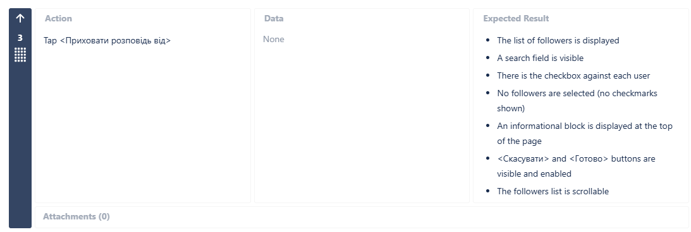
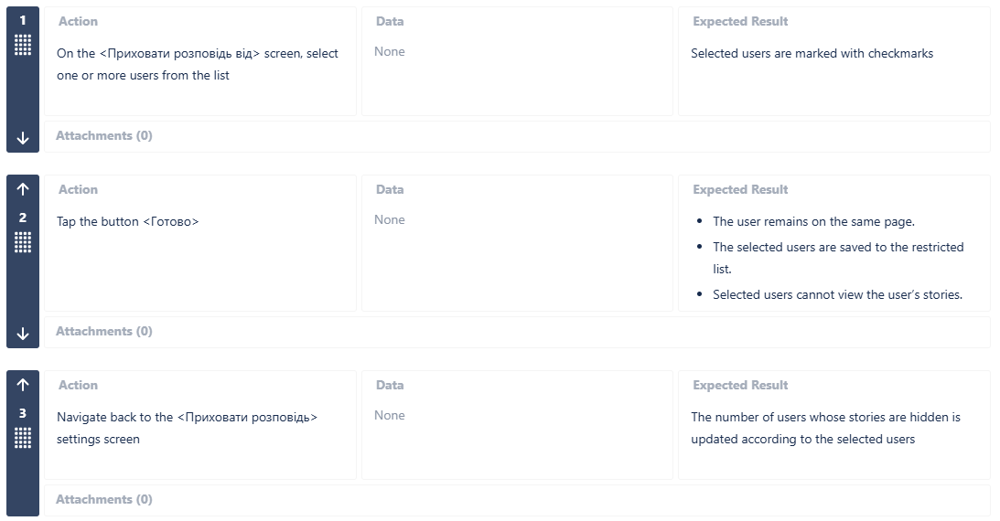
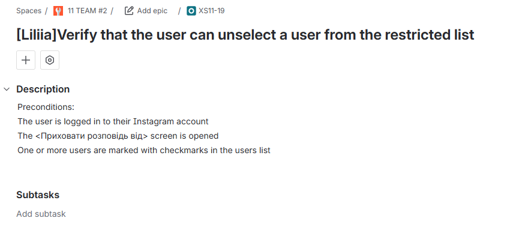
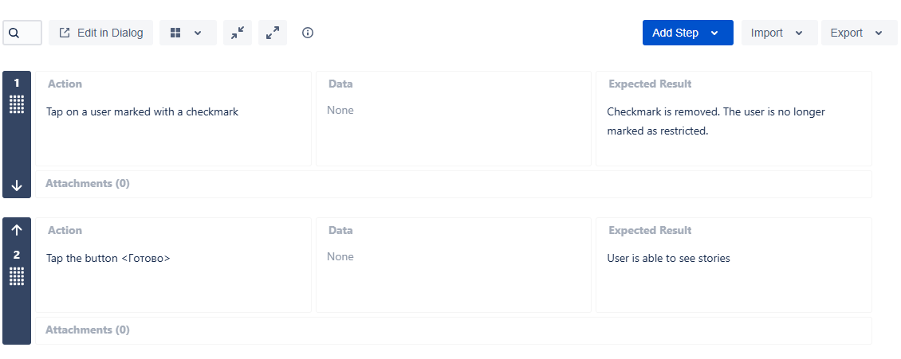

# 📋 Test Cases  
Feature: Restrict Story Visibility

---

## TC-01: Verify that the restricted list is empty by default

**ID:** XS11-16   

### Preconditions:
- The user is logged into their Instagram account  
- The user has at least one follower  

### Steps & Expected Results:

**Step 1:** Navigate to User Profile → Settings  
**Expected Result:**  
- The profile settings page is displayed  
- No users are restricted from viewing stories  

---

**Step 2:** Tap `<Приховати історію>`  
**Expected Result:**  
- The user is navigated to the `<Приховати розповідь>` page  
- The restricted users count is 0  
- A back arrow is visible  
- The user can proceed to manage restricted users  

---

**Step 3:** Tap `<Приховати розповідь від>`  
**Expected Result:**  
- The followers list is displayed  
- A search field is visible  
- A checkbox is displayed next to each user  
- No followers are selected (no checkmarks shown)  
- An informational block is displayed at the top of the page  
- `<Скасувати>` and `<Готово>` buttons are visible and enabled  
- The followers list is scrollable  

## 📸 Jira Example

---

---

## TC-02: Verify that the user can hide stories from specific followers

**ID:** XS11-18  

### Preconditions:
- The user is logged into their Instagram account  
- The user is on the `<Приховати розповідь від>` screen  
- The user has at least one follower  

### Steps & Expected Results:

**Step 1:** Select one or more users from the list  
**Expected Result:**  
- Selected users are marked with checkmarks  

---

**Step 2:** Tap the `<Готово>` button  
**Expected Result:**  
- The user remains on the settings page  
- The selected users are saved to the restricted list  
- Selected users cannot view the user’s stories  

---

**Step 3:** Navigate back to `<Приховати розповідь>` screen  
**Expected Result:**  
- The number of restricted users is updated according to selected users  

## 📸 Jira Example

---

---

## TC-03: Verify that the user can unselect a user from the restricted list

**ID:** XS11-19  

### Preconditions:
- The user is logged into their Instagram account  
- The `<Приховати розповідь від>` screen is opened  
- One or more users are marked as restricted  

### Steps & Expected Results:

**Step 1:** Tap on a user marked with a checkmark  
**Expected Result:**  
- The checkmark is removed  
- The user is no longer marked as restricted  

---

**Step 2:** Tap the `<Готово>` button  
**Expected Result:**  
- Changes are saved successfully  
- The user is removed from the restricted list  
- The user can view the stories again

## 📸 Jira Example

