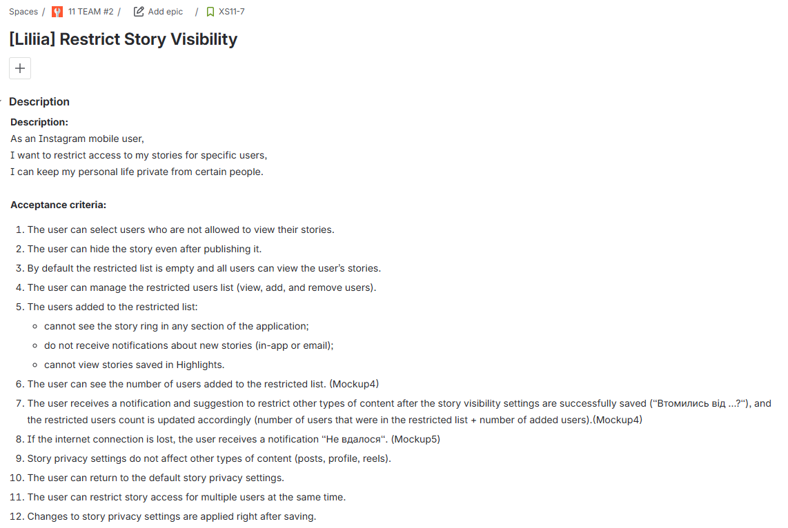
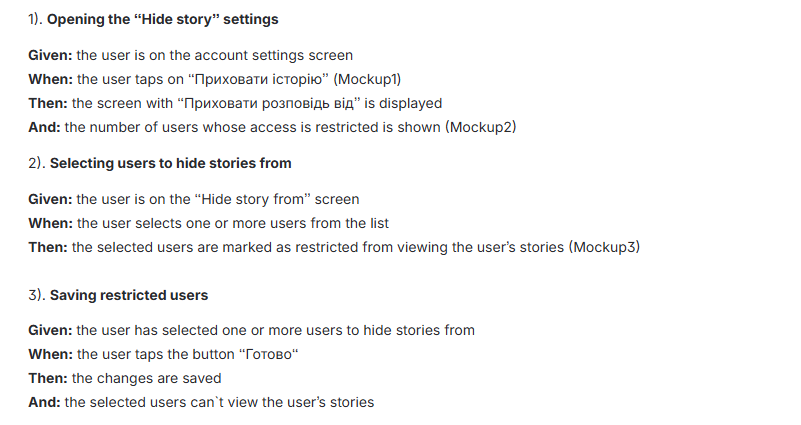

# 📱 Feature: Restrict Story Visibility

## 🧾 User Story

As a mobile social media user,  
I want to restrict access to my stories for specific users,  
so that I can keep my personal life private from certain people.

---

## ✅ Acceptance Criteria

1. The user can select one or multiple users to restrict story visibility.
2. The user can hide a story even after publishing it.
3. By default, the restricted list is empty and all users can view stories.
4. The user can view, add, and remove users from the restricted list.
5. Restricted users:
   - cannot see the story ring in any section of the application;
   - do not receive notifications about new stories (in-app or email);
   - cannot view stories saved in Highlights.
6. The user can see the total number of restricted users.
7. If the internet connection is lost while saving changes, an error message is displayed.
8. Story privacy settings do not affect other content types (posts, profile, reels).
9. The user can return to default story privacy settings.
10. Changes to story visibility are applied immediately after saving.

---

## 🔍 Test Scenarios

### Scenario 1: Opening “Hide Story” Settings
**Given** the user is on the account settings screen  
**When** the user selects the “Hide Story” option  
**Then** the “Hide story from” screen is displayed  
**And** the number of restricted users is shown  

---

### Scenario 2: Selecting Users to Restrict
**Given** the user is on the “Hide story from” screen  
**When** the user selects one or multiple users  
**Then** the selected users are marked as restricted  

---

### Scenario 3: Saving Restricted Users
**Given** the user has selected users to restrict  
**When** the user taps the “Save” button  
**Then** the changes are saved successfully  
**And** the selected users cannot view the user’s stories  

---

### Scenario 4: Internet Connection Lost
**Given** the user is saving story visibility settings  
**When** the internet connection is lost  
**Then** an error notification is displayed  
**And** changes are not applied

---

## 📸 Jira Example

