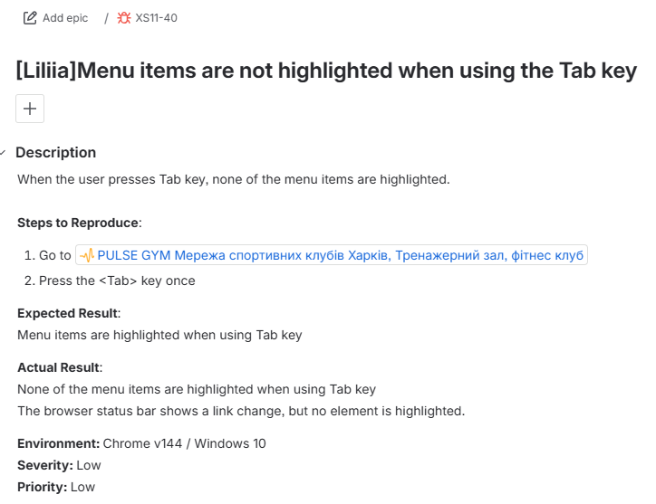
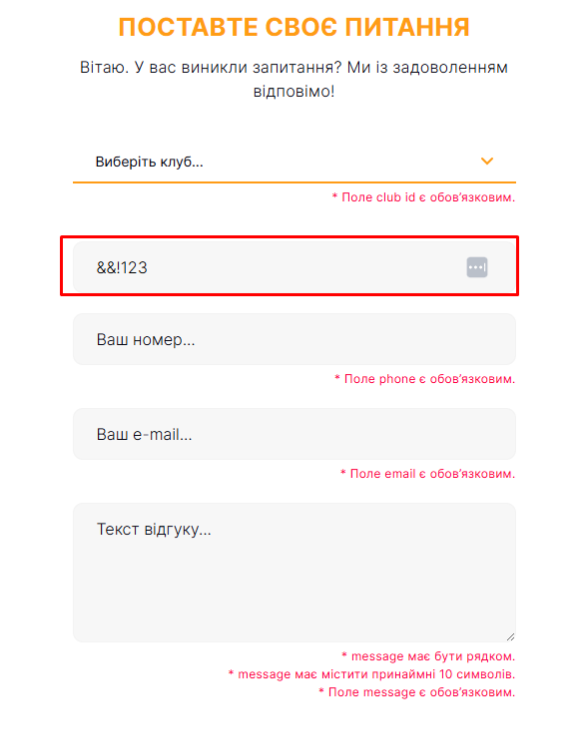
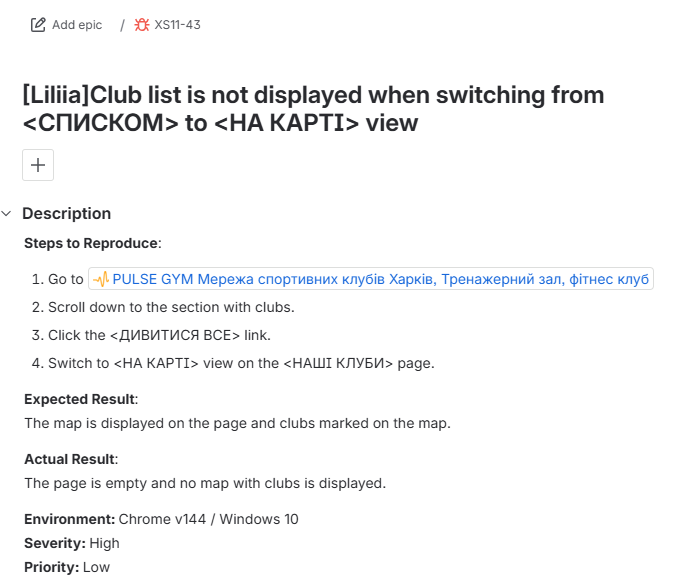
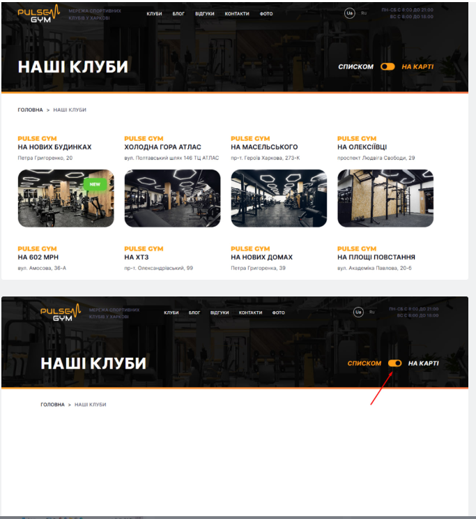

# 🐞 Bug Report XS11-40

## Summary
Menu items are not highlighted when using the `<Tab>` key.

---

## Description
When the user presses `<Tab>` key, none of the menu items are highlighted.

---

## Steps to Reproduce
1. Go to https://pulse-gym.com.ua/
2. Press the `<Tab>` key once.

---

## Expected Result
Menu items are highlighted when using `<Tab>` key

---

## Actual Result
- None of the menu items are highlighted when using `<Tab>` key
- The browser status bar shows a link change, but no element is highlighted.

---

## Environment
Chrome v144 / Windows 10

---

## Severity
Low

## Priority
Low

## 📸 Jira Example

---

---

# 🐞 Bug Report XS11-41

## Summary
Name field accepts invalid input without validation in the contact form.

---

## Steps to Reproduce
1. Go to https://pulse-gym.com.ua/
2. Click on the contact form icon in the lower-left corner of the screen
3. Enter an invalid name in the `<Name>` field, which containing special characters or numbers (e.g. 123@@)
---

## Expected Result
The `<Name>` field should display a validation error message and indicate invalid input.

---

## Actual Result
The form accepts invalid input in the `<Name>` field and no error message is displayed.
---

## Environment
Chrome v144 / Windows 10

---

## Severity
Low

## Priority
Low

## 📸 Jira Example

---

---

# 🐞 Bug Report XS11-43

## Summary
Club list is not displayed when switching from `<СПИСКОМ>` to `<НА КАРТІ>` view.

---

## Steps to Reproduce
1. Go to https://pulse-gym.com.ua/
2. Scroll down to the section with clubs.
3. Click the `<ДИВИТИСЯ ВСЕ>` link.
4. On the `<НАШІ КЛУБИ>` page, switch to `<НА КАРТІ>` view.
---

## Expected Result
The map is displayed on the page and clubs marked on the map.
---

## Actual Result
The page is empty and no map with clubs is displayed.

---

## Environment
Chrome v144 / Windows 10

---

## Severity
High

## Priority
Low

## 📸 Jira Example

