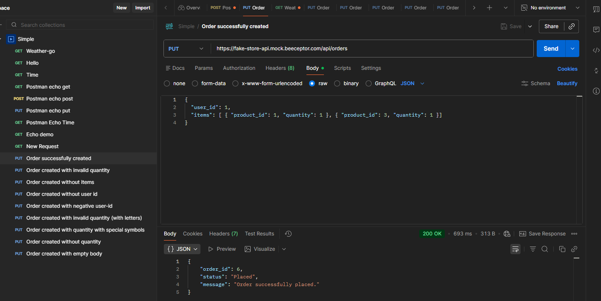
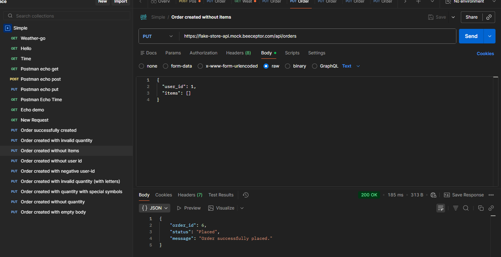
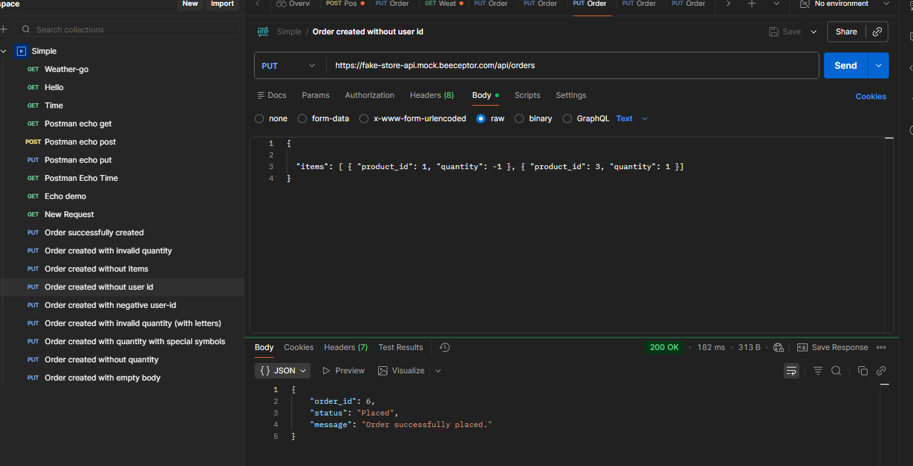
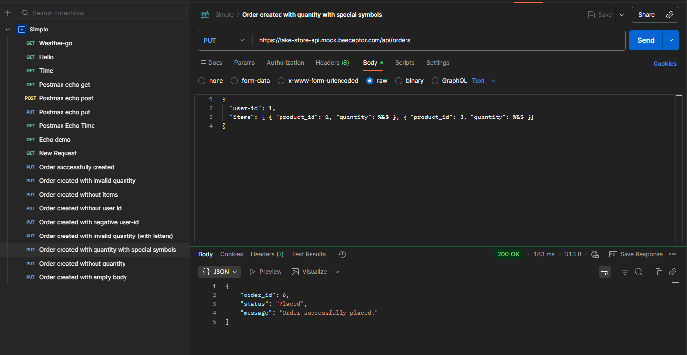
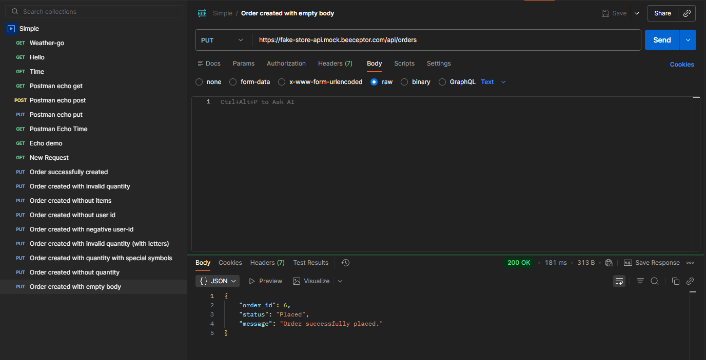

# API Testing

## Project
Fake Store API Testing

## Tool
Postman

---

# Positive Test Case

## Scenario: Create order with valid data

### Request
{
"user_id": 1,
"items": [ { "product_id": 1, "quantity": 1 }, { "product_id": 3, "quantity": 1 }]
}

### Expected Result
Status Code: 200
Order ID returned
Response contains:
- order_id  
- status  
- message  

### Actual Result
200 OK  
Order successfully created.

---

# Negative Test Cases

## API_1
Summary: Order created with invalid quantity  
Input: "quantity": -1  
Expected Result: 400 Bad Request  
Actual Result: 200 OK  

## API_2
Summary: Order created without items  
Input: "items": []  
Expected Result: 400 Bad Request  
Actual Result: 200 OK  

## API_3
Summary: Order created without user id  
Input: user_id removed  
Expected Result: 400 Bad Request  
Actual Result: 200 OK  

## API_4
Summary: Order created with negative user-id  
Input: "user_id": -1  
Expected Result: 400 Bad Request  
Actual Result: 200 OK  

## API_5
Summary: Order created with invalid quantity (with letters)  
Input: "quantity": dqhvdb  
Expected Result: 400 Bad Request  
Actual Result: 200 OK  

## API_6
Summary: Order created with quantity with special symbols  
Input: "quantity": %&$  
Expected Result: 400 Bad Request  
Actual Result: 200 OK  

## API_7
Summary: Order created without quantity  
Input: quantity removed  
Expected Result: 400 Bad Request  
Actual Result: 200 OK  

## API_8
Summary: Order created with empty body  
Input: Empty body  
Expected Result: 400 Bad Request  
Actual Result: 200 OK  

---

# Issues Identified During Testing

During testing, validation issues were identified:

- API returns 200 OK for invalid inputs  
- Required fields are not validated  
- Data types are not strictly checked  
- Business logic validation is missing

## 📸 Postman Examples

